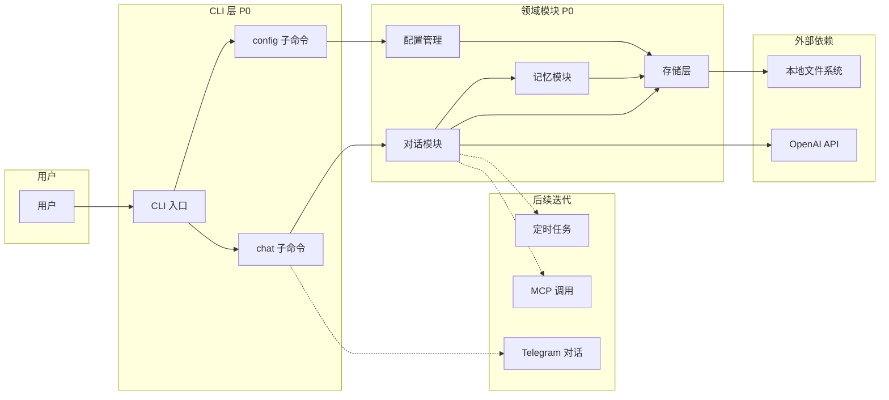
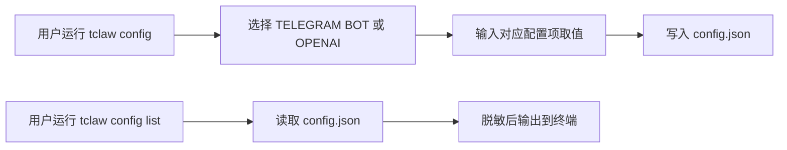
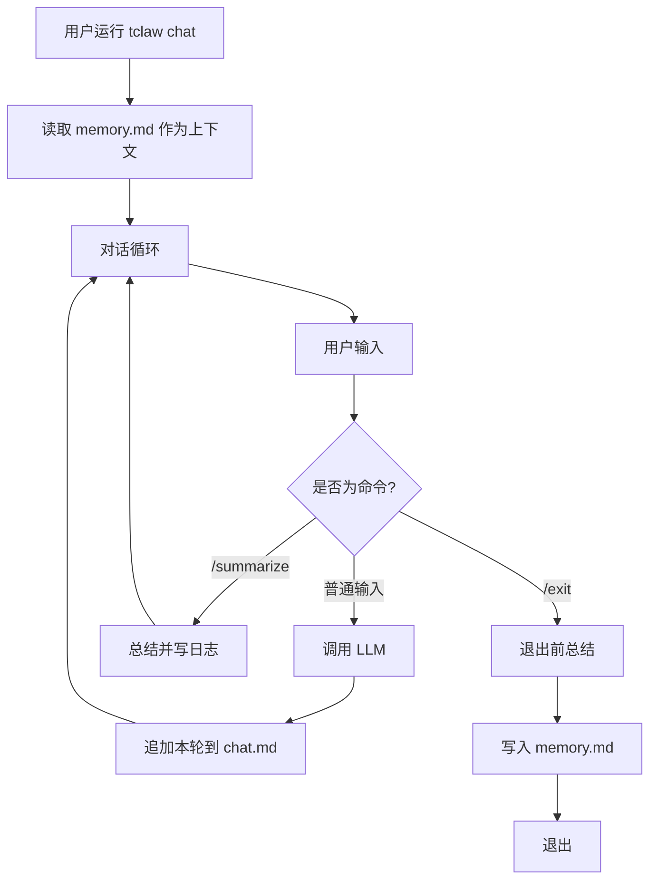

# mini-openclaw 架构文档

## 1. 概述

本项目为 [openclaw](https://github.com/openclaw/openclaw) 的最小实践，通过 CLI 完成配置与本地对话。

- **P0 边界**：仅实现 CLI 配置与本地对话；Telegram 真实对话、定时任务与 MCP 的具体实现属后续迭代。
- **核心用户路径**：配置（`tclaw config` / `tclaw config list`）→ 对话（`tclaw chat`）→ 记忆（退出时总结写入 memory.md，再次进入时加载摘要）。

所有命令行格式均为 `tclaw <command>`。

## 2. 系统架构图



## 3. 模块划分

### 3.1 CLI 层

- **职责**：解析 `tclaw <command>`，将请求分发到对应子命令。
- **子命令**：
  - `config`：进入交互式配置（单选 TELEGRAM BOT / OPENAI，逐项输入值）。
  - `config list`：列出当前所有配置项 key 及脱敏后的值。
  - `chat`：进入对话界面。

### 3.2 配置模块

- **职责**：config 交互流程、config list、读写 config.json、脱敏展示、`~/.tclaw` 目录及必要文件首次初始化。
- **配置项**：TELEGRAM BOT（如 TELEGRAM_BOT_TOKEN）、OPENAI（OPENAI_API_KEY、OPENAI_API_BASE、OPENAI_MODEL_NAME）；P0 仅支持 OpenAI API 模型，不实现真实 Telegram 对话。

### 3.3 对话模块

- **职责**：chat 循环、解析用户输入；处理 `/exit`（退出）、`/summarize`（总结并保存到日志）；与 LLM 请求/响应；每轮对话追加写入 chat.md。
- **依赖**：配置模块（读取 API Key）、存储层（读写 chat.md）、记忆模块（进入时加载 memory.md、退出时触发总结）。

### 3.4 记忆模块

- **职责**：用户退出对话后立即总结当前对话，并写入 `~/.tclaw/memory.md`；用户进入 chat 时读取 memory.md 作为上下文（仅加载摘要，完整历史仍在 chat.md）。

### 3.5 存储层

- **职责**：统一 `~/.tclaw` 根路径，管理各文件的读写；首次使用时自动创建目录及约定文件。
- **文件**：config.json、chat.md、memory.md、skill.md、personality.md（见第 5 节表格）。

### 3.6 LLM 适配

- **职责**：P0 仅封装 OpenAI API 调用，供对话模块使用；接口设计便于后续扩展其他模型或渠道。

## 4. 数据流

### 4.1 配置流



### 4.2 对话流



## 5. 存储与文件约定

| 路径 | 用途 | 格式 | 写入方 | 读取方 |
|------|------|------|--------|--------|
| `~/.tclaw/` | 用户数据根目录 | 目录 | 存储层（首次创建） | 各模块 |
| `~/.tclaw/config.json` | 用户配置（TELEGRAM_BOT_TOKEN、OPENAI_API_KEY、OPENAI_API_BASE、OPENAI_MODEL_NAME） | JSON | 配置模块 | 配置模块、对话/LLM |
| `~/.tclaw/chat.md` | 历史对话记录 | Markdown | 对话模块 | 对话模块（展示历史） |
| `~/.tclaw/memory.md` | 对话记忆摘要（每次对话会重新加载） | Markdown | 记忆模块 | 对话模块（上下文） |
| `~/.tclaw/skill.md` | agent 学习的 skill | Markdown | 后续迭代 | 后续迭代 |
| `~/.tclaw/personality.md` | agent 人格定义 | Markdown | 后续迭代 | 后续迭代 |

与 [设计文档](设计文档.md) 第 2 节 2.1–2.6 一致；首次使用时自动创建 `~/.tclaw` 及上述文件（按需创建或占位）。

## 6. 技术栈与约束

- **运行时**：Bun
- **语言**：TypeScript
- **代码质量与格式化**：Biome
- **运行方式**：通过 `bun run index.ts` 或可执行入口（如 bin 配置的 `tclaw`）启动
- **部署形态**：无服务端；仅本地进程 + 调用 OpenAI API，所有持久化在 `~/.tclaw`

## 7. 推荐目录结构

便于按本架构落地实现的建议目录与文件划分：

```
src/
  cli.ts              # CLI 入口，解析 command 并分发
  commands/
    config.ts         # tclaw config / config list
    chat.ts           # tclaw chat
  config/             # 配置模块（读写 config.json、脱敏、初始化）
  chat/               # 对话模块（循环、/exit、/summarize、调用 LLM）
  memory/             # 记忆模块（总结、读写 memory.md）
  storage/            # 存储层（~/.tclaw 路径、各文件读写封装）
  llm/                # LLM 适配（OpenAI API 封装）
index.ts              # 入口，调用 src/cli
```

各目录与第 3 节模块一一对应，便于维护与测试。

## 8. 后续迭代预留

以下能力在设计文档中已列出，P0 仅列出或占位，具体规范待补充：

- **Telegram 对话**：真实 Telegram Bot 对话（当前仅配置项 TELEGRAM_BOT_TOKEN）。
- **定时任务**：用户通过对话设定定时任务。
- **MCP 调用**：用户通过对话调用 MCP；具体协议与集成方式待补充。

在架构图中以虚线关联至 CLI/对话模块，实现时可在 `commands/chat.ts` 或对话模块内预留扩展点（如命令解析 `/schedule`、`/mcp` 等）。
